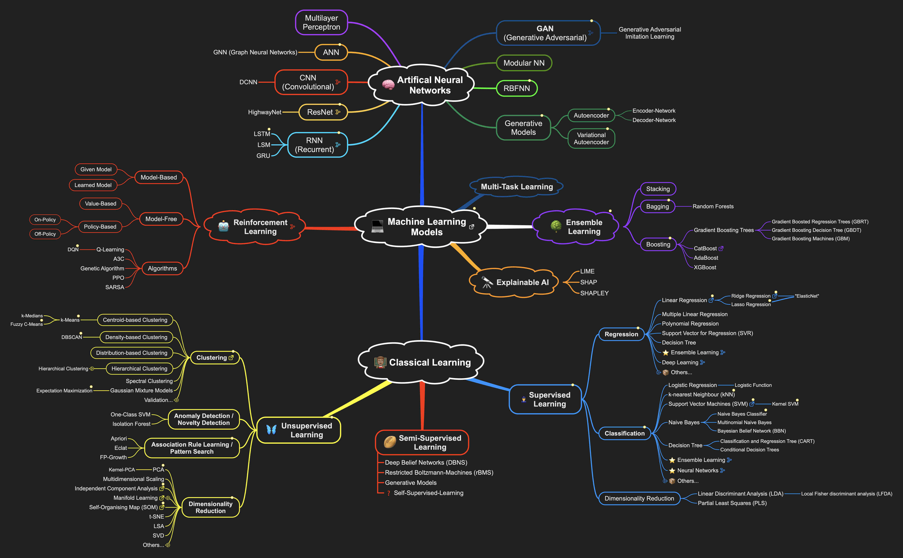

# Notes, Cheat-Sheets, etc. 🐍

This is a collection of some (hopefully useful) notes, cheat sheets, and other stuff. 🌿

## Table of Contents

```
📦Notes-Cheat-Sheets-etc.
 ┣ 📂Cheat_Sheets
 ┃ ┣ 📜conda
 ┃ ┣ 📜docker
 ┃ ┣ 📜git
 ┃ ┣ 📜matplotlib
 ┃ ┣ 📜numpy
 ┃ ┗ 📜pandas
 ┣ 📂Figures
 ┃ ┣ 📜Deep_Learning_Workflow
 ┃ ┣ 📜Machine_Learning_Overview
 ┃ ┗ 📜Reinforcement_Learning
 ┣ 📂Notes
 ┃ ┣ 📜Deep_Learning
 ┃ ┣ 📜Preprocessing
 ┃ ┣ 📜Reinforcement_Learning
 ┃ ┣ 📜Supervised_Learning
 ┃ ┗ 📜Unsupervised_Learning
 ┗ 📜README
```
---

## Examples 💁🏽‍♂️

### Machine Learning Overview


---

### Docker Cheat Sheet (Excerpt)

```bash
# Show Version
docker -v    # Check the current version
docker info  # Get even more information

# List all images
docker images                          # list all images
docker image rm <image_name>           # remove an image
docker build <path> --tag <image_name> # build image from dockerfile

# List running containers
docker ps        # list running containers
docker ps -a     # list running and stopped containers

...
```

---
### Preprocessing Notes (Excerpt)

```markdown
### 👨🏽‍🍳 Feature Selection

- [ ] Independent variables (X), Dependent variables (Y)
- [ ] Feature Selection 🧮
  - [ ] Feature Importance Evaluation (e.g., with Random Forest)
- [ ] Dimensionality Reduction (PCA, t-SNE)
- [ ] Feature Engineering: Combining features to create new ones

---

### 🔍 Missing Values

1. [ ] Drop Columns 🗑
2. [ ] Imputation 💧 (Replace by mean/median/most frequent of the column)
3. [ ] Extended Imputation 💦 (Keep track of imputed values)

- [ ] KNN-Imputation, and other advanced methods
- [ ] Target Encoding for categorical variables with many categories
- [ ] Handling of rare categories
...

```

## Contact 📬

If you have any questions or suggestions, feel free to reach out to me: 

https://www.ini.rub.de/the_institute/people/tom-maus/

---